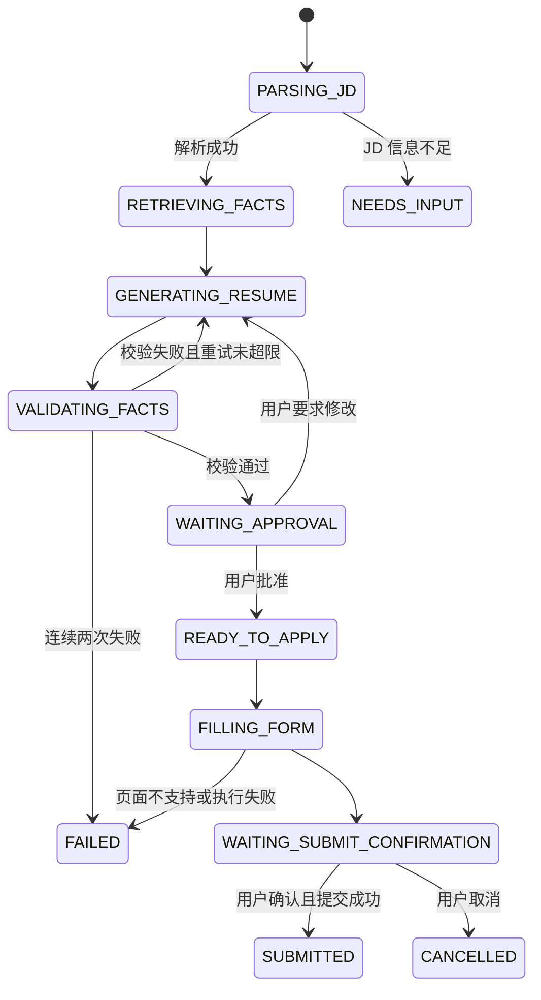

# ApplyPilot

基于个人事实约束的校招简历生成与半自动投递 Agent。

## 项目定位

直接用通用大模型生成求职简历存在三个实际问题：模型可能编造未发生的经历、技能或量化数据；不同职位的简历版本缺少统一管理，无法追溯内容来源；职位分析、简历生成、人工确认和投递记录分散在多个工具中。

ApplyPilot 将个人经历建模为可引用的事实库，通过有限状态的 Agent 工作流完成 JD 解析、经历检索、简历生成、事实校验和人工审批，并在授权后辅助填写招聘表单。核心闭环：

```
JD 解析 -> 经历检索 -> 简历生成 -> 事实校验 -> 人工审批 -> 表单填写 -> 投递记录
```

它不是通用聊天机器人，独立价值来自招聘领域的数据模型、事实约束、简历版本管理、人工审批和投递生命周期。

## 核心特性

- **个人事实库**：每条事实表达一个可独立核验的动作、结果或技能，带技能标签、量化指标和证据引用（commit、文档、测试）。
- **混合检索**：元数据硬过滤 + PostgreSQL 全文检索 + pgvector 语义召回，合并去重后按可解释加权分数排序。
- **事实约束生成**：模型只能使用检索到的事实生成简历内容，每条输出必须携带 `fact_ids` 引用；量化指标逐字来自事实的 `metrics` 字段。
- **幻觉拦截**：确定性规则（事实存在性、数字/技能边界、表述越界）优先，模型复核补充；校验失败退回生成节点，超限则转人工。
- **人工审批**：简历版本批准后冻结为不可变版本；所有自动提交前强制人工确认。
- **断点恢复**：工作流每个节点完成后持久化状态，服务重启后从最后一个成功节点恢复。
- **半自动投递**：Playwright 辅助填写招聘表单，填写前后截图，无法识别字段时暂停等待人工，不处理验证码、不绕过网站风控。

## 技术栈

| 能力 | 选型 |
| --- | --- |
| API 服务 | Python 3.12、FastAPI |
| 工作流 | LangGraph（显式节点、条件边、中断与状态持久化） |
| 数据库 | PostgreSQL + pgvector |
| 数据校验 | Pydantic |
| 浏览器工具 | Playwright |
| 审核页面 | Jinja2、原生 JavaScript |
| 文档导出 | python-docx |
| 部署 | Docker Compose |
| 测试 | pytest、testcontainers-python |

## 工作流状态图



## 项目状态

核心链路已打通并通过真实模型冒烟验证（导入 → 解析 → 检索 → 生成 → 校验 → 审批 → DOCX）：

- [x] 产品与技术设计（[docs/design.md](docs/design.md)）
- [x] 数据模型 Schema 与确定性事实校验（含技术词表边界、语义复核层）
- [x] JD 解析与事实导入（DeepSeek 适配器，修复重试）
- [x] 全文 + pgvector 混合检索（本地 bge 嵌入，可解释加权打分）
- [x] 分区结构简历生成与 LangGraph 编排（PostgreSQL checkpointer 断点恢复）
- [x] 人工审批页面与 DOCX 导出（Jinja2 审核台）
- [x] FastAPI 接口（幂等键、版本冻结）
- [x] Docker Compose 一键启动
- [ ] Playwright 表单填写
- [ ] 评测数据集与报告

## 快速开始

```bash
python -m venv .venv
# Windows: .venv\Scripts\activate
pip install -r requirements.txt
docker compose up -d   # 启动 PostgreSQL + pgvector
pytest
```

使用真实模型时，在 `.env`（已 gitignore）中配置：

```bash
DEEPSEEK_API_KEY=sk-...
DEEPSEEK_MODEL=deepseek-chat
```

## 范围控制

MVP 明确不做：多平台全面适配、验证码绕过、未经确认的批量自动投递、邮箱自动收发、多用户 SaaS、微服务与独立向量数据库、无界 Think-Execute 循环。

## 隐私与安全

- 业务数据默认只保存在本地 PostgreSQL。
- 模型 API 密钥通过环境变量提供，不写入仓库和数据库。
- 日志对电话、邮箱、身份证、Token 和 Cookie 脱敏。
- 所有自动提交都需要用户最终确认。

## 文档

- [产品与技术设计](docs/design.md)

## License

MIT
