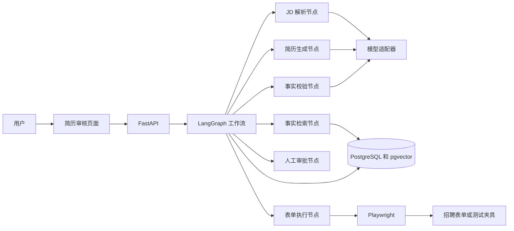
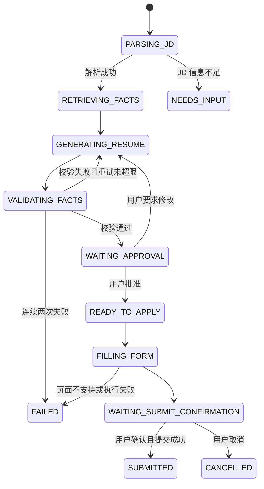

# ApplyPilot 产品与技术设计

文档日期：2026-09-04  
文档状态：两周 MVP 设计基线  
项目定位：后端能力为基础、Agent 工作为差异化的个人求职项目

## 1. 背景

校招过程中，同一名求职者需要反复阅读职位描述、判断匹配程度、调整简历内容并记录投递状态。直接使用通用大模型虽然可以生成简历，但存在三个实际问题：

1. 模型可能编造未发生的经历、技能或量化数据。
2. 不同职位生成的简历版本缺少统一管理，无法追溯每条内容来自哪段真实经历。
3. 职位分析、简历生成、人工确认和投递记录分散在多个工具中，失败后难以恢复。

ApplyPilot 将个人经历建模为可引用的事实库，通过有限状态的 Agent 工作流完成 JD 解析、经历检索、简历生成、事实校验和人工审批，并在授权后辅助填写招聘表单。


## 2. 目标与成功标准

### 2.1 产品目标

- 输入职位 JD 文本或公开职位页面后，输出结构化岗位要求。
- 从个人事实库中检索与岗位相关的实习、项目和技能。
- 生成一份针对该职位的简历内容，并让每条生成内容能够追溯到事实来源。
- 在发现无事实依据、数字不一致或技能越界时阻止生成结果进入待投递状态。
- 经用户确认后辅助填写招聘表单，并保存职位、简历版本和投递结果。

### 2.2 MVP 验收标准

- 能导入现有简历并生成结构化事实记录。
- 能处理至少 30 条不同类型的校招 JD。
- 能完成一次从 JD 输入到定制简历生成的端到端流程。
- 最终简历中的每条经历描述都包含至少一个有效事实引用。
- 人为加入不存在的技能或量化数据时，事实校验节点必须拒绝结果。
- 工作流中断后可以从已持久化节点恢复，不需要重新执行全部步骤。
- Playwright 能在本地表单夹具和允许自动化的目标页面中完成字段识别、填写、截图和人工确认。
- 项目能够通过 Docker Compose 在干净环境中启动。
- 仓库包含自动化测试、评测数据说明和一次可复现的评测报告。

## 3. 范围控制

### 3.1 两周 MVP 包含

- JD 文本输入；URL 抽取作为便利入口，抽取失败时允许用户粘贴文本。
- 个人事实库导入、编辑、停用和查询。
- 基于元数据过滤、全文检索和向量相似度的混合检索。
- 有限状态 Agent 工作流和节点级持久化。
- 事实引用、结构校验、数字校验和技能边界校验。
- 简历内容预览、人工修改和批准。
- 生成内容导出为 DOCX，保留结构化 JSON 作为版本事实源。
- Playwright 表单填写、截图、失败记录和可选提交。
- 职位、简历版本、工作流运行和投递记录查询。
- Docker Compose、基础日志、测试和评测脚本。

### 3.2 两周 MVP 不包含

- 多个招聘平台的全面适配。
- 验证码绕过、反爬绕过或规避网站风控。
- 未经用户确认的批量自动投递。
- 邮箱自动收取面试通知和自动回复。
- 多用户 SaaS、付费、权限组织和运营后台。
- 微服务、Kubernetes、复杂消息平台和专用向量数据库。
- 让模型自由运行的无界 Think-Execute 循环。

## 4. 技术选型

| 能力 | 选型 | 选择理由 |
| --- | --- | --- |
| API 服务 | Python 3.12、FastAPI | Agent 生态成熟，接口和异步任务实现成本低 |
| 工作流 | LangGraph | 显式节点、条件边、中断和状态持久化适合人工审批流程 |
| 数据库 | PostgreSQL | 同时保存职位、事实、版本、任务和审计数据 |
| 语义检索 | pgvector | MVP 复用 PostgreSQL，避免额外维护独立向量数据库 |
| 数据校验 | Pydantic | 为模型输出和工具输入建立可执行 Schema |
| 浏览器工具 | Playwright | 支持稳定的字段定位、填写、截图和浏览器上下文隔离 |
| 审核页面 | Jinja2、原生 JavaScript | 满足单用户审核需求，避免为 MVP 引入独立前端工程 |
| 文档导出 | python-docx | 从结构化简历版本生成可编辑的 DOCX |
| 部署 | Docker Compose | 一条命令启动 API、PostgreSQL 和本地依赖 |
| 测试 | pytest、testcontainers-python | 覆盖纯逻辑、真实 PostgreSQL、工作流和浏览器夹具 |

MVP 不引入 Redis。工作流状态、幂等键和任务记录首先由 PostgreSQL 承担；只有实际并发和吞吐需求超过单库任务模型时，再单独评估消息队列。

## 5. 总体架构



系统保持一个部署单元。FastAPI 负责 API 和应用服务，LangGraph 只负责编排节点，PostgreSQL 是状态事实源，Playwright 作为受控工具执行表单操作。

## 6. 核心数据模型

### 6.1 `facts` 个人事实

| 字段 | 含义 |
| --- | --- |
| `id` | 稳定事实 ID |
| `fact_type` | internship、project、skill、award、education |
| `source_name` | 亚信实习、商城项目等来源 |
| `content` | 不可继续拆分的事实描述 |
| `start_date`、`end_date` | 经历发生时间 |
| `skills` | 技能标签数组 |
| `metrics` | 可使用的量化指标及单位 |
| `evidence_type` | commit、document、test、self_report |
| `evidence_ref` | 提交号、文件路径或验证说明 |
| `embedding` | 语义向量 |
| `enabled` | 是否允许用于生成 |

事实库不使用固定 Token 切片。每一条事实表达一个可独立核验的动作、结果或技能，避免把多个项目和时间段切进同一文本块。

### 6.2 其他核心表

- `jobs`：职位原文、来源、公司、岗位名称和解析结果。
- `resume_versions`：目标职位、生成内容、提示词版本、审批状态和创建时间。
- `resume_claims`：简历中的单条表述以及其引用的事实 ID。
- `workflow_runs`：当前节点、状态、重试次数、输入摘要和错误信息。
- `applications`：职位、简历版本、投递渠道、幂等键、状态和结果。
- `audit_events`：关键操作、节点转换、人工修改和浏览器执行结果。

## 7. Agent 工作流



工作流采用显式状态和有限重试，不让模型自由决定是否持续执行。每个节点完成后保存状态和输出摘要，服务重启后从最后一个成功节点恢复。

## 8. 各节点职责

### 8.1 JD 解析节点

将职位原文解析为以下结构：

- 岗位名称、职位类别和工作地点。
- 必备条件、加分条件和职责。
- 技术关键词及其重要级别。
- 学历、毕业时间、实习或项目要求。
- 无法从原文确定的信息。

解析结果必须符合 `JobRequirements` Pydantic Schema。模型不得把“加分项”提升为“硬性要求”。

### 8.2 事实检索节点

检索分三步：

1. 使用毕业时间、事实启用状态、经历类型等元数据进行硬过滤。
2. 使用 PostgreSQL 全文检索匹配明确技能词和业务词。
3. 使用 pgvector 召回语义相关事实，并与全文结果合并去重。

默认返回前 5 条候选事实，同时保留各事实的检索来源和得分。MVP 不增加独立重排模型，使用必备技能覆盖、文本匹配和向量相似度的可解释加权分数。

### 8.3 简历生成节点

模型只能使用检索节点提供的事实生成内容。每条输出采用：

```json
{
  "text": "承担运维工具批量执行模块开发……",
  "fact_ids": ["fact_intern_batch_01", "fact_intern_batch_02"],
  "matched_requirements": ["Java", "异步任务", "故障恢复"]
}
```

模型负责选择与改写，不负责创造事实。量化指标必须逐字来自被引用事实的 `metrics` 字段。

### 8.4 事实校验节点

校验按确定性规则优先、模型复核补充的顺序执行：

- 引用的事实 ID 必须存在且处于启用状态。
- 新出现的数字、日期、公司、奖项和技能必须能在引用事实中找到。
- 不允许把“参与评审”改写为“独立设计”或“负责实现”。
- 不允许把组内提出的方案描述为个人原创框架。
- 不允许把计划中、未验收的功能写成已完成。
- 规则通过后，再由模型检查语义是否超出事实含义。

失败结果附带错误码和修改建议，最多退回生成节点两次；仍失败则转为 `FAILED`，等待人工处理。

### 8.5 人工审批节点

用户可以接受、编辑、退回或取消。人工修改也必须重新进入事实校验。审批完成后冻结一个不可变的简历版本，后续修改生成新版本。

### 8.6 表单执行节点

Playwright 读取经批准的个人信息和简历文件，根据标签、字段名、输入类型和适配器配置填写表单。MVP 支持：

- 文本框、下拉框、单选、多选和文件上传。
- 填写前后截图。
- 无法识别字段时暂停并请求用户处理。
- 在最终提交按钮前强制人工确认。
- 仅对明确允许的适配器执行提交。

系统不处理验证码，不保存招聘网站明文密码，也不尝试绕过网站限制。

## 9. 主要 API

| 方法 | 路径 | 用途 |
| --- | --- | --- |
| POST | `/api/facts/import` | 从现有简历导入事实草稿 |
| GET | `/api/facts` | 查询和筛选事实 |
| PUT | `/api/facts/{id}` | 修正或停用事实 |
| POST | `/api/jobs` | 保存并解析 JD |
| GET | `/api/jobs/{id}/match` | 获取岗位匹配结果 |
| POST | `/api/workflows` | 启动定制简历工作流 |
| GET | `/api/workflows/{id}` | 查询节点状态和错误 |
| POST | `/api/workflows/{id}/approve` | 批准或退回简历 |
| GET | `/api/resume-versions/{id}/docx` | 导出已批准的 DOCX 简历 |
| POST | `/api/applications/{id}/fill` | 启动表单填写 |
| POST | `/api/applications/{id}/submit` | 人工确认后提交 |
| GET | `/api/applications` | 查询投递记录 |

创建工作流和投递记录的接口接受 `Idempotency-Key`。数据库使用唯一约束保证同一用户、职位、简历版本和投递渠道不会重复创建有效投递。

## 10. 错误处理与可靠性

- 模型输出解析失败：保留原始输出摘要，使用结构修复提示重试一次。
- 模型调用超时：节点标记为可重试失败，采用有限退避，最多两次。
- JD 抽取失败：回退到手工粘贴文本，不阻断其他功能。
- 检索结果不足：提示事实缺口，不用模型补写经历。
- 事实校验失败：返回具体 claim、事实 ID 和失败原因。
- 浏览器字段无法识别：截图并暂停，允许用户手工处理后继续。
- 浏览器进程退出：投递状态保持未提交，禁止自动判定成功。
- 服务重启：从 `workflow_runs` 中最后一个成功节点恢复。

## 11. 隐私与安全

- 业务数据默认只保存在本地 PostgreSQL，不同步到额外的第三方求职服务。
- 使用远程模型时，只发送当前节点所需的 JD 和候选事实，并在设置页明确提示数据将离开本机；后续可以增加本地模型适配器。
- 模型 API 密钥通过环境变量提供，不写入仓库和数据库。
- 日志对电话、邮箱、身份证、Token 和 Cookie 脱敏。
- Playwright 使用独立浏览器上下文，认证状态存储与项目数据分离。
- 删除事实时采用停用而非直接物理删除，已生成版本继续保留引用快照。
- 所有自动提交都需要用户对目标职位和简历版本进行最终确认。

## 12. 测试与评测

### 12.1 自动化测试

- 单元测试：JD Schema、事实数字提取、技能边界、混合检索合并和幂等键。
- 数据库集成测试：事实版本、工作流恢复、简历版本冻结和重复投递约束。
- 工作流测试：正常通过、校验退回、重试超限、人工修改和用户取消路径。
- 浏览器测试：使用至少 20 个不同字段结构的本地 HTML 表单夹具。
- 安全测试：日志中不得出现完整电话、邮箱、Cookie 或模型密钥。

### 12.2 评测数据集

评测集使用至少 30 条真实校招 JD，并人工标注：

- 必备技能和加分技能。
- 与 JD 相关的事实 ID。
- 不应出现在简历中的事实。
- 允许使用的量化指标。

### 12.3 指标口径

- `Recall@5`：人工标注的相关事实中，有多少出现在前 5 条检索结果中。
- 事实一致率：通过人工复核的生成 claim 数量除以全部生成 claim 数量。
- 岗位关键词覆盖率：简历实际覆盖的必备关键词数量除以 JD 必备关键词总数。
- 工作流成功率：无需开发者介入即可进入人工审批状态的运行比例。
- 表单填写成功率：测试夹具中全部必填字段正确填写的页面比例。

简历中的 `82.4% -> 98.1%`、`64.8% -> 87.4%` 是当前模拟目标，只用于文案结构评估。项目完成后必须由版本化评测脚本生成真实结果；若真实结果没有提升，则删除对比表述。

## 13. 两周实施顺序

| 天数 | 交付物 | 验收方式 |
| --- | --- | --- |
| 第 1 天 | 仓库、配置、数据模型和示例 JD | API 启动，迁移成功 |
| 第 2 天 | 简历事实导入和事实管理 | 能导入当前简历并人工修正 |
| 第 3-4 天 | JD 解析和 Pydantic Schema | 多种 JD 均输出合法结构 |
| 第 5 天 | 全文和向量混合检索 | 标注样例可计算 Recall@5 |
| 第 6 天 | 事实约束的简历生成 | 每条 claim 返回事实 ID |
| 第 7 天 | 确定性事实校验 | 虚构数字和技能被拒绝 |
| 第 8 天 | LangGraph 编排和状态恢复 | 正常、退回、失败路径通过 |
| 第 9 天 | 工作流及版本管理 API | 接口测试通过 |
| 第 10 天 | 最小审核页面和 DOCX 导出 | 能查看、修改、批准并下载简历 |
| 第 11 天 | Playwright 表单填写 | 表单夹具填写和截图通过 |
| 第 12 天 | 端到端测试和评测脚本 | 生成首份评测报告 |
| 第 13 天 | Docker Compose 和运行文档 | 干净环境一键启动 |
| 第 14 天 | 演示脚本、缺陷修复和简历证据 | 完整演示可重复执行 |

若进度延迟，优先保证事实库、工作流、事实校验和评测闭环。Playwright 的真实网站适配可以缩减为本地表单夹具和一个允许自动化的适配器，但不能删除人工审批。

## 14. 关键技术取舍

### 14.1 为什么使用有限状态工作流

简历生成和投递包含明确业务阶段，不需要无界自主循环。显式状态图更容易测试、恢复和审计，也能限制模型重复调用和意外投递。

### 14.2 为什么不使用固定 Token 切片

简历事实天然具有结构边界。按事实切分能够保留时间、角色、指标和证据关系，并让生成结果准确引用来源。

### 14.3 为什么 MVP 不引入 Redis

两周内系统只有单用户和有限任务量。PostgreSQL 足以承担状态持久化、幂等约束和任务查询，引入 Redis 会增加部署面而没有必要收益。只有实测发现长任务并发或队列吞吐成为问题时再增加。

### 14.4 为什么保留人工审批

简历和投递属于高影响操作。人工审批既能避免模型错误，也能规避招聘网站字段变化、职位过期和误投风险。

## 15. 简历表述解锁条件

以下能力完成对应验收后才能写入正式简历：

| 简历表述 | 必须具备的证据 |
| --- | --- |
| LangGraph 多阶段工作流 | 工作流代码、状态图测试、恢复测试 |
| 事实引用和幻觉拦截 | 事实 Schema、校验测试、失败样例 |
| PostgreSQL/pgvector 混合检索 | 标注集、检索脚本、Recall@5 报告 |
| Playwright 辅助投递 | 表单夹具、截图、成功与失败记录 |
| 事实一致率和关键词覆盖率 | 固定数据集、指标定义、原始结果和报告 |
| Docker 一键运行 | 干净环境启动记录和演示步骤 |

项目没有完成某项验收时，应从简历中删除对应技术或结果，而不是使用设计文档代替实现证据。

## 16. 最终演示流程

1. 导入当前简历，展示事实及其证据类型。
2. 输入一条 Java 后端或 Agent 岗位 JD。
3. 展示结构化岗位要求和召回的事实。
4. 生成定制简历，并查看每条内容引用的事实 ID。
5. 人为加入不存在的指标，展示校验节点拒绝结果。
6. 修正并批准简历版本。
7. 使用 Playwright 填写测试招聘表单并停在提交确认页。
8. 查看职位、简历版本、工作流节点和投递审计记录。

完成以上流程即构成两周 MVP 的完整闭环。
